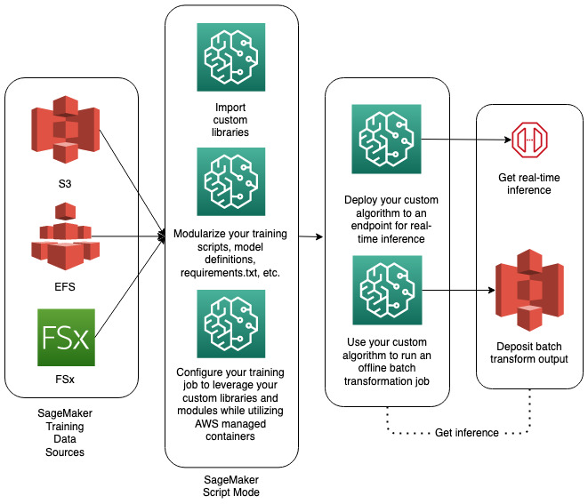

# Custom Training

Amazon Sagemaker Tutorials Examples - https://github.com/aws/amazon-sagemaker-examples/tree/4534bff4b5b5062af5789d98c4ddca01b0cb5d1f


- 

1. SageMaker Built-in Algorithms & Pre-built Containers
Quick Start: Use SageMaker’s built-in algorithms or pre-built Docker containers for frameworks like TensorFlow, PyTorch, Scikit-learn, etc.
How: Specify the algorithm/container while defining your Estimator in SageMaker SDK, or via the AWS Console.
 

2. Custom Script Mode
Fully Customizable: Write your own Python script (training script) and use SageMaker’s built-in containers (for frameworks like TensorFlow, PyTorch, XGBoost).
How:
Your script accepts command-line arguments (argparse) for hyperparameters and data locations.
Use a built-in container + your script via TensorFlow, PyTorch, or relevant estimator in the SageMaker Python SDK.
Example:
    ```
    from sagemaker.pytorch import PyTorch  
    
    pytorch_estimator = PyTorch(entry_point='train.py',  # Your script  
                                role=role,  
                                framework_version='1.9.0',  
                                instance_count=1,  
                                instance_type='ml.m5.xlarge')  
    pytorch_estimator.fit({'training': 's3://your-bucket/data'})  
     
    ``` 

3. Bring Your Own Container (BYOC)
Full Flexibility: Package your code, dependencies, and environment in a custom Docker container.
Use Case: When you need packages not in supported framework containers, want full OS control, or use an uncommon language/framework.
How:
Write a Dockerfile that sets up the training environment.
Package your training script, dependencies, and create the image.
Push the image to Amazon ECR.
Launch a SageMaker training job pointing to your custom container.
Docs: Bring Your Own Training Container
 

4. SageMaker Experiments & Hyperparameter Tuning
Use the above methods and wrap your custom job in a hyperparameter tuning job (HPO) or organize multiple runs with SageMaker Experiments for custom search and tracking.
 

5. Using SageMaker Studio & Notebooks
Interactive: Use Studio or classic notebooks.
Define your custom script/container locally, then run as a SageMaker training job programmatically or through point-and-click interface.
 

Summary Table
 
| Method                | Code Required | Container Management      | Flexibility                   | Common Use Case                       |  
|-----------------------|--------------|--------------------------|-------------------------------|---------------------------------------|  
| Built-in Algorithms   | Minimal      | None (AWS managed)       | Least                         | Quick, standard ML tasks              |  
| Script Mode           | Yes          | None (AWS managed)       | Medium                        | Custom models with supported frameworks|  
| Bring Your Own Container (BYOC) | Yes        | Yes (You manage)           | Most                          | Uncommon libraries, full custom stack |  
| Notebook/Studio       | Yes          | AWS-managed or Custom    | Medium–High                   | Interactive development & experiments |  			
---				
 				
## Which Should You Use?				
Standard deep learning (TensorFlow/PyTorch): Use Script Mode for quick customization.
Unusual dependencies or language: Use BYOC.
Fast experiments: Studio/Notebook mode.
Production/enterprise: Use SDK to define/tracking jobs in code, or manage via pipelines.
 
